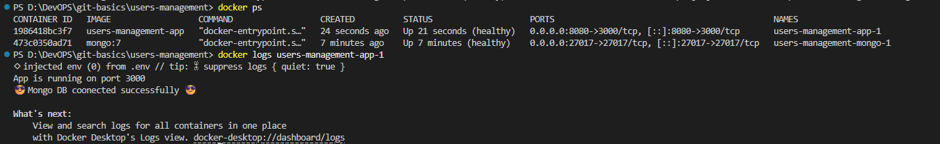
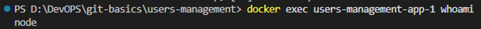
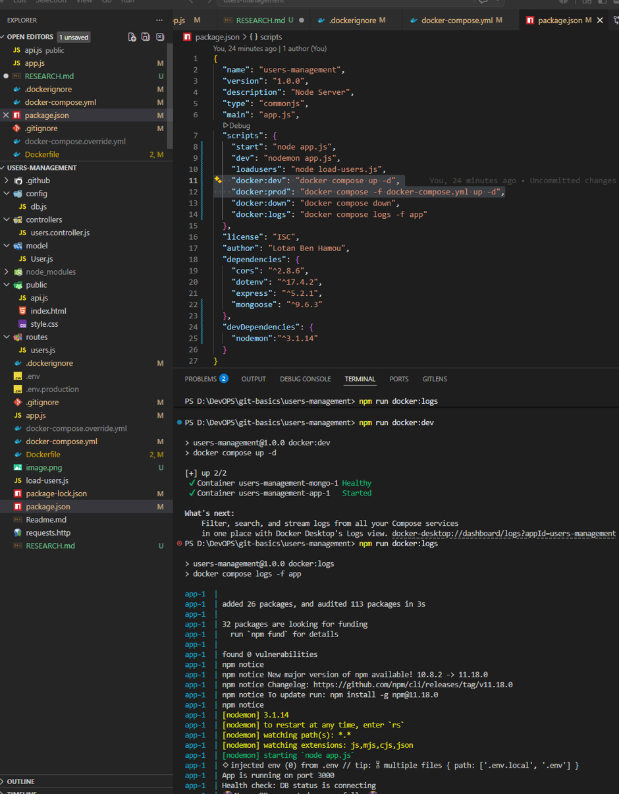
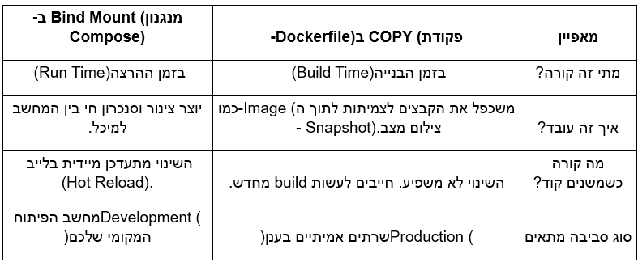
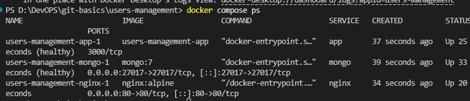
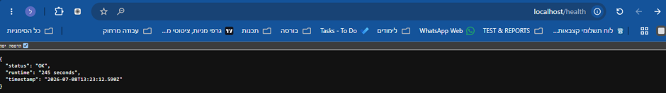

סיכום פרויקט: אופטימיזציה של ארכיטקטורת 
Docker 
לסביבת    Production 

הפרויקט עוסק בשדרוג וייעול אפליקציה מבוססת 
Docker 
לצורך התאמתה לסביבת עבודה מקצועית ומאובטחת.

1.אופטימיזציה וצמצום משקל ה-Image
בשלב הראשון בוצע צמצום משמעותי של נפח ה
-Image
 של האפליקציה באמצעות שלוש שיטות מרכזיות:
•	Multi-stage build: שימוש במספר פקודות 
FROM ב-Dockerfile
 אחד כדי להפריד בין סביבת הבנייה לסביבת הריצה הנקייה.
•	שימוש ב-Alpine Linux: מעבר לסביבת עבודה מינימליסטית ומאובטחת.
•	.dockerignore: החרגת קבצים מיותרים (כמו .env וקבצי פיתוח) בתהליך הבנייה.
תוצאה: משקל ה
-Image ירד מ-224MB ל-216MB.
 --צילום מסך של השוואת גדלי ה-Images לפני ואחרי

למה זה חשוב? צמצום הגודל משפר את מהירות ה
-Push/Pull, מקצר את זמן ה-Deploy 
בענן, חוסך בעלויות אחסון ומצמצם את "שטח התקיפה" של האקרים

2. הבטחת רציפות שירות באמצעות Healthcheck
כדי לפתור את בעיית תזמון העלייה של שירותים (למשל, אפליקציה שעולה לפני בסיס הנתונים), הוטמע מנגנון
 Healthcheck בשילוב עם depends_on.
•	עבור ה-MongoDB
 הוגדרה פקודת ping
  פנימית שבודקת אם בסיס הנתונים מוכן לקבל חיבורים.
•	האפליקציה תתחיל לרוץ רק כאשר ה
-Mongo מוגדר במצב Healthy.
--צילום מסך של סטטוס ה-Container במצב healthy

3. אבטחת מידע: הרצה כמשתמש Non-Root
כדי למנוע פריצות מסוג 
Container Escape 
(שבהן האקר משתלט על השרת המארח דרך הקונטיינר),
 האפליקציה הוגדרה לרוץ תחת משתמש מוגבל בשם
  node במקום משתמש root.
•	עיקרון ההרשאה המינימלית: האפליקציה מקבלת רק את ההרשאות הנחוצות לה להרצת הקוד.
•	בדיקת תקינות: הרצת פקודת
 whoami בתוך הקונטיינר.
--צילום מסך של פקודת 
whoami המציגה את המשתמש node

4. הפרדת סביבות פיתוח (Dev) וייצור (Prod)
נעשה שימוש במנגנון 
Deep Merge של Docker Compose להפרדת הגדרות:
•	בפיתוח (Dev): נעשה שימוש ב-
Bind Mount 
כדי לאפשר סנכרון חי של הקוד 
(Hot Reload) ונוחות עבודה.
•	בייצור (Prod): קבצי הקוד ננעלים בתוך ה
-Image באמצעות פקודת 
COPY 
כדי להבטיח יציבות, אבטחה וביצועים גבוהים.
-- צילום מסך של הלוגים

-- צילום מסך לחקר על bind mount

5. שימוש ב-Nginx כ-Reverse Proxy
הוספת שרת Nginx כ"שומר סף" בחזית האפליקציה.
•	תפקידים עיקריים: הסתרת הפורט הפנימי, איזון עומסים (Load Balancing), טיפול בהצפנת SSL (TLS) והגשת קבצים סטטיים במהירות.
•	בדיקה: גישה לכתובת http://localhost/health המאשרת שהתקשורת עוברת דרך Nginx בהצלחה.
--Image of: --

